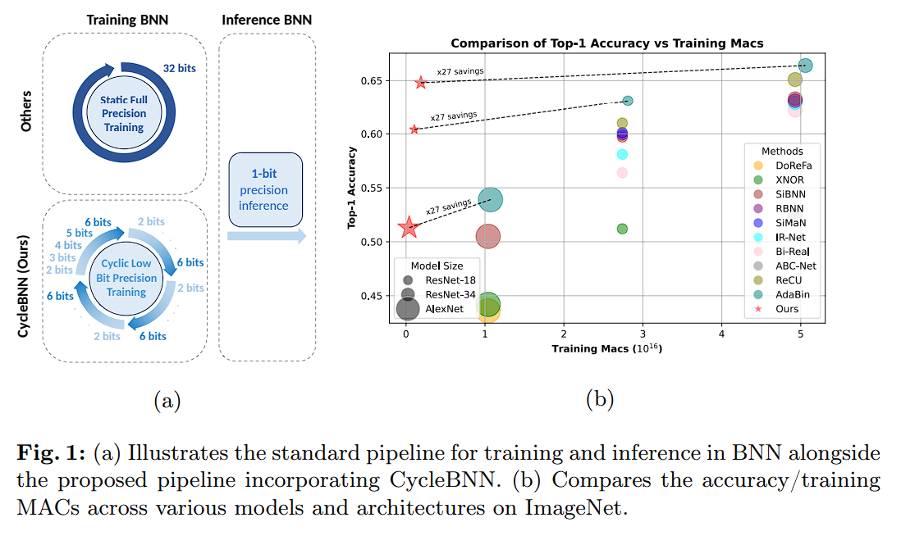
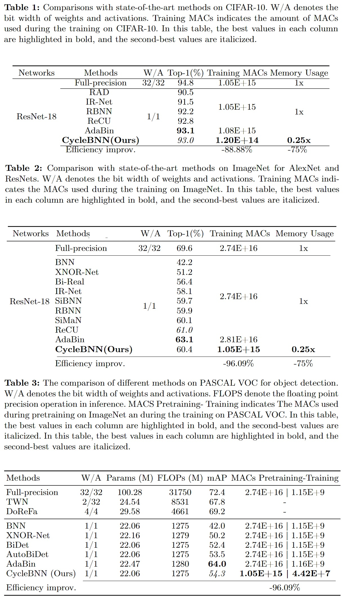

# CycleBNN


Welcome to the CycleBNN. This repository is dedicated to facilitating the training of Binary Neural Networks (BNNs) with a focus on efficiency. Our training routines are designed to work with ImageNet, CIFAR-10, and Pascal VOC datasets.

## Environment Setup

Before proceeding with the training or fine-tuning processes, it is essential to set up the environment correctly. Please use the following Docker image to ensure compatibility and reproducibility of results:

```
docker pull 1208977/random_cyclebnn

```

This Docker image contains all necessary dependencies and environments pre-configured for your convenience.

## Training Instructions

Below are detailed commands for training the ResNet18 architecture on different datasets. Please ensure that the data directories contain the correctly formatted datasets before proceeding.

### Training on ImageNet

To train a ResNet18 model on the ImageNet dataset, use the following command:

```bash
python main.py -save_folder ./logs --arch imagenet_resnet_18 --workers 5 --datadir ./imagenet2012 --is_cyclic_precision --cyclic_num_bits_schedule 2 6 --cyclic_num_grad_bits_schedule 8 8 --num_cyclic_period 8 --lr 0.001 --num_cyclic_annealing 1 --iters 9000000 --batch_size 16 --optimizer adamw --lr_schedule cosine --clamping_tau no --dataset imagenet --eval_every 1250
```

### Training on CIFAR-10

For training the ResNet18 model on the CIFAR-10 dataset, execute:

```bash
python main.py -save_folder ./logs --arch cifar10_resnet_18 --workers 5 --datadir ./data --is_cyclic_precision --cyclic_num_bits_schedule 2 6 --cyclic_num_grad_bits_schedule 8 8 --num_cyclic_period 8 --lr 0.001 --num_cyclic_annealing 1 --iters 187500 --batch_size 16 --optimizer adamw --lr_schedule cosine --clamping_tau no --dataset imagenet --eval_every 1250
```

## Fine-Tuning and Testing on Pascal VOC

### Fine-Tuning ResNet18

To fine-tune a ResNet18 model specifically for the Pascal VOC dataset, please use the script provided:

```bash
./run.sh
```

This script will automatically adjust the model parameters for optimal performance on the Pascal VOC dataset.

### Testing Fine-Tuned ResNet18

After fine-tuning, you can test the performance of the ResNet18 model on the Pascal VOC dataset with:

```bash
./run_test.sh
```

This will evaluate the model against the dataset and provide performance metrics.


## Results



## Acknowledgments

This work is based on contributions from several outstanding repositories. We extend our gratitude to the authors of the following repositories for their groundbreaking work in the field of efficient computing and binary neural networks:

- [Efficient Computing - AdaBin by Huawei Noah's Ark Lab](https://github.com/huawei-noah/Efficient-Computing/tree/master/BinaryNetworks/AdaBin)
- [ReCU by Z. Xu](https://github.com/z-hXu/ReCU)
- [BiDet by Ziwei Wang](https://github.com/ZiweiWangTHU/BiDet)
- [CPT by GATECH-EIC](https://github.com/GATECH-EIC/CPT)

Their contributions have significantly influenced the development of our project, and we highly recommend referring to their work for additional insights into binary neural networks and efficient computing.

